# C++ 利用QML实现电影字幕拼接小程序

>本课程利用QT开发环境来实现一个电影字幕拼接小程序。前端用QT中的最新技术QML实现，后端用C++与之交互。该软件实现的功能是
：批量导入字幕图片，可以调整字幕图片的顺序，可以调整字幕的位置，可以设置主图的显示区域大小，可以将拼接好图片保存三种大小格式，同时由于本次实验没有进行太复杂的设计，目前只支持相同大小的图片进行字幕拼接，对于尺寸不同的图片进行拼接的效果可能不好。本实验分三部分，第一部分介绍QML的基础语法知识。第二部分用QML设计出我们的前端界面。第三部分介绍C++与QML的交互方式，并完成整个程序。

```QMLLearn.tar.gz```是第一个实验的代码。

```Zimu.tar.gz```是第二，三个实验的代码。

```字幕拼接测试图片.tar.gz```是字幕拼接程序的测试图片。


最终效果图如下所示（显示不清楚，可能需要重新截图):


<div align = center>

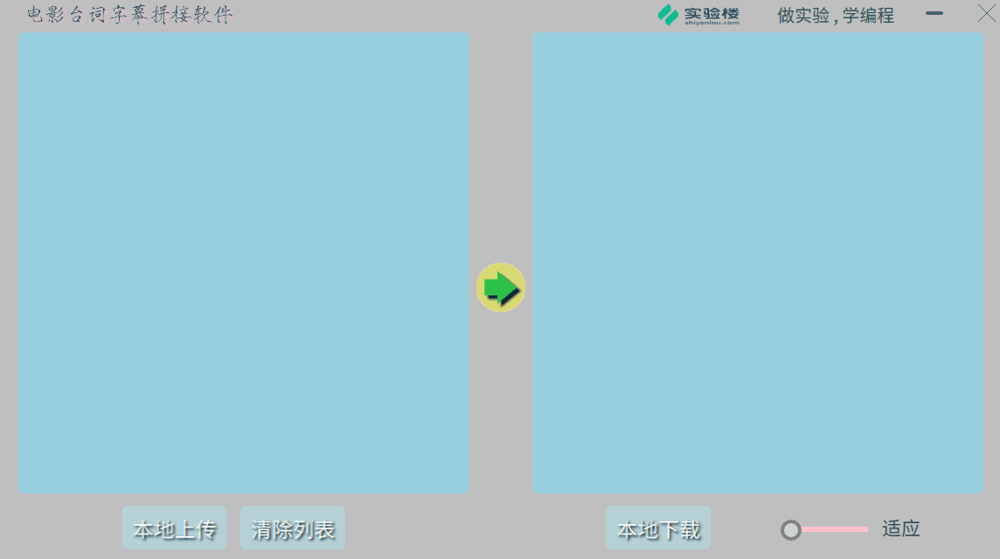

图1 操作演示图

</div>

<div align = center>

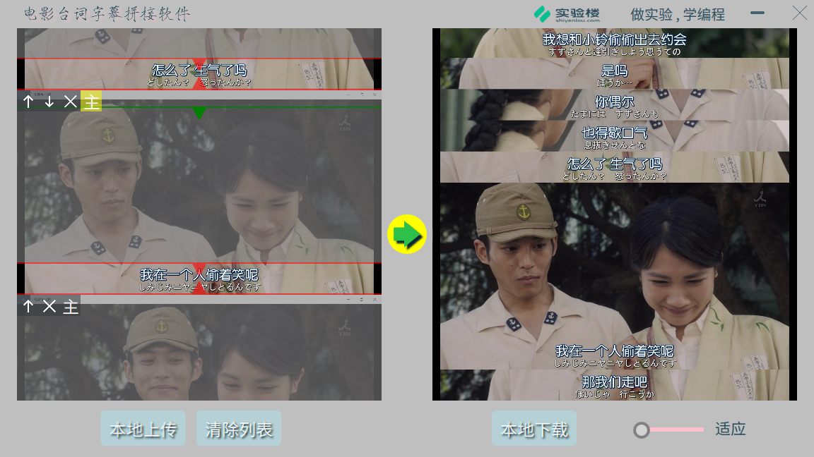

图2 最终效果图

</div>

# 实验一 QML介绍与学习

## 一，实验内容

本次实验主要介绍Qt和QML的基本语法，着重介绍前端设计的知识，通过基本图形控件设计出我们需要的前端控件，最后用学习的控件模仿一个实验楼官网的前端页面。

效果图如下所示:

<div align=center>

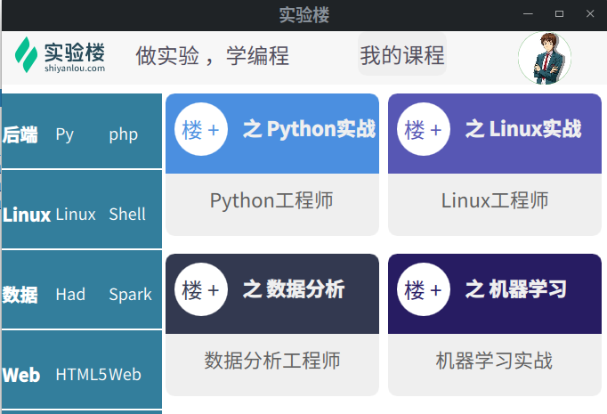

图 用QML模仿实验楼网站

</div>

### 1.1 知识点
- Qt环境搭建

- QML基本语法

- QML组件布局

### 1.2 实验环境

- Ubuntu 16.04
- xfce终端
- Qt

### 1.3 Qt环境搭建（参照实验楼Qt课程)

```shell
$ cd /home/shiyanlou

//Qt下载
$ wget http://labfile.oss.aliyuncs.com/courses/1186/qt-opensource-linux-x64-5.8.0.run

//权限
$ chmod 777 qt-opensource-linux-x64-5.8.0.run

//安装
$ ./qt-opensource-linux-x64-5.8.0.run

//接下来会运行安装程序，第一步可以跳过，其它选择默认就行,完成安装
```
安装完成后，可以点击屏幕左下方的 ```所有应用程序>>开发>>Qt Creator``` 打开应用。

## 二，QML介绍与学习

QML是一种描述性的脚本语言，文件格式以.qml结尾。```语法格式非常像CSS，但又支持javascript形式的编程控制。```QML可以在脚本里创建图形对象，并且支持各种图形特效，以及状态机等，```同时又能跟Qt写的C++代码进行方便的交互，使用起来非常方便。```QML可以设计出扁平化的风格，界面设计更加自由化，向html靠近，对于属性html前端设计的同学来说学习qml很容易。

### 2.1 从Qt中创建QML文件

从Qt中创建一个QML文件的步骤如下:

```新建工程 >>选择第三项Qt Quick Application Empty```创建一个空的QML工程文件
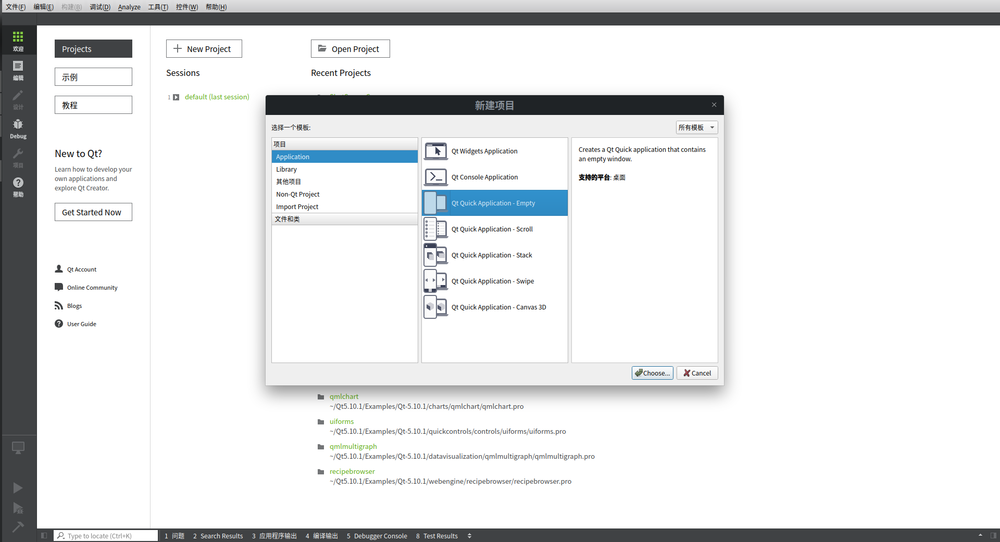

然后选择工程的保存路径，剩下的设定按照默认的选择即可。
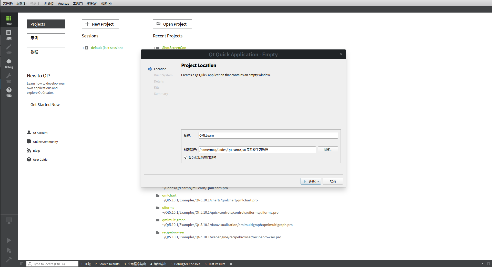
完毕，Qt的脚手架会创建一个main.qml文件，还是那个人见人爱的"hello world"
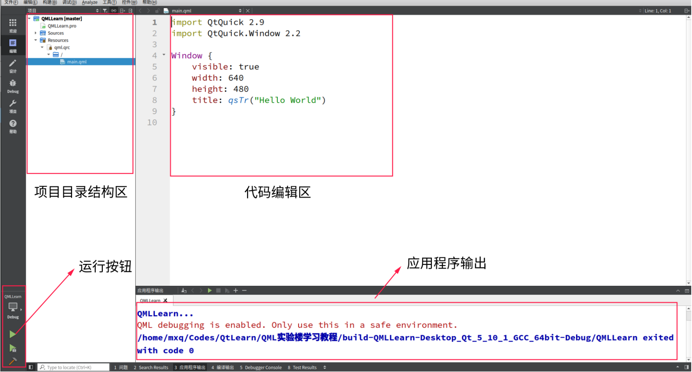

Qt的主工程文件也会包含关于QML的相关依赖(红色部分)。

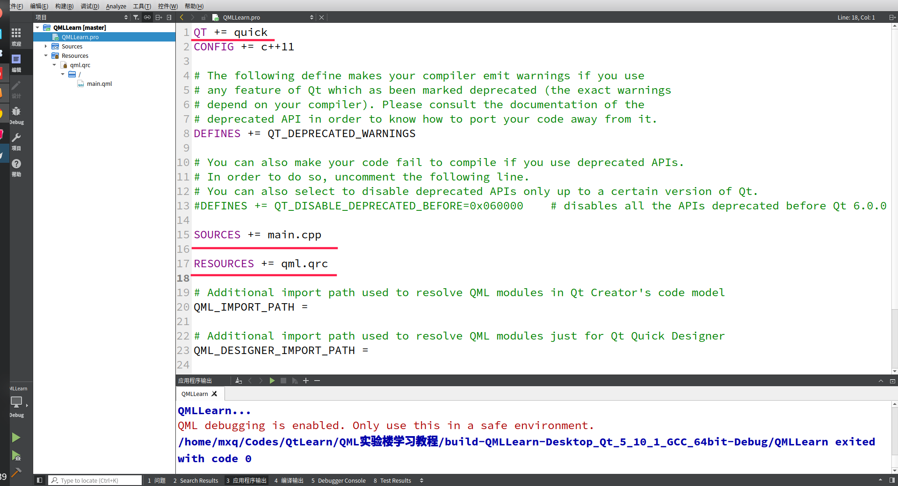

### 2.2 QML常用类型和属性

QML的语法和CSS类似，先定义一个类型（Type)，然后设定该类各种属性。类型之间可以嵌套，来表示继承关系。
一个工程文件中会有一个主qml文件,main.qml,这个文件最终会被main.cpp调用，在该类设置的变量可以被其他qml文件直接调用。各种qml文件之间可以相互导入。
#### 创建QML文件

选择qml.qrc >> 选择添加新文件 >> 选择QML File >> 填入文件名(命名时，首字母必须大写！)。其他默认即可。

<div align=center>

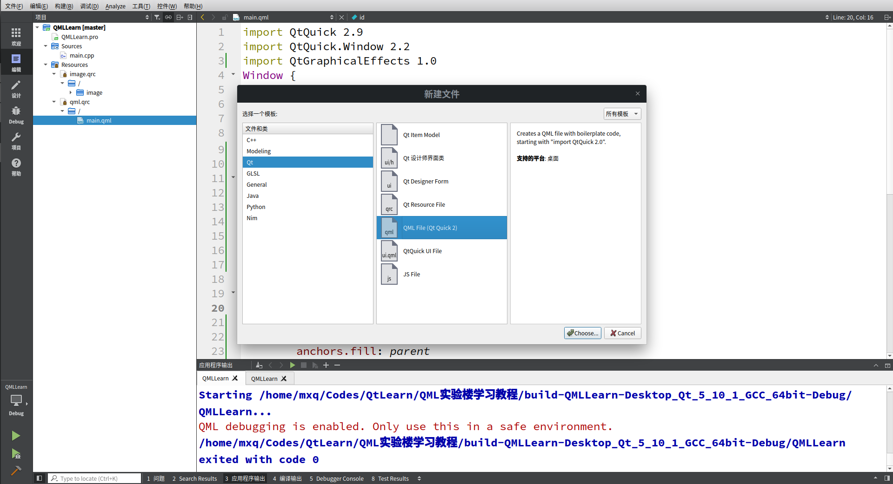

</div>

#### 2.2.1 Rectangle和Text

Rectangle绘制一个矩形，是常用的一个类型，用途非常广，可以用来绘制一个应用程序的主界面，可以用来布局，可以来作为一个按钮的基本图形等。

创建Rectangle时，使用关键字Rectangle，所有的属性都在{ }中进行设定。
常用的属性如下表所示：

|属性|描述|
|----|---|
|id|唯一标识符|
|width|矩形长度|
|width|矩形宽度|
|color|颜色|
|visible|可见性|
|opacity|透明度(0-1)|
|radius|弧度|

Text是用来显示文字的：

|属性|描述|
|----|---|
|font.pixelSize|字体大小|
|text|显示文字|
|color|颜色|
|font.family|设置字体|

新建一个qml文件，取名```Rectanglelearn.qml```，代码如下，首先要导入一些需要的库，这些库都是Qt自带的，不需要第三方安装。QtQuick是主库的名称，后面需要跟库的版本号，不同的版本号会功能会有不同。Item是用来包裹这些类的，没有可见属性。

以下代码实现了一个矩形，里面的文字居中显示,透明度为0.5，通过修改radius属性绘制带弧度的矩形或圆形。
一个类下可以嵌套另一个类，下面的代码中Text类嵌套在Rectangle中，那么Rectangle就是Text的parent。类进行定位时可以使用parent作为参考线，如这里```anchors.centerIn:parent```就是将子类的中心位置放在父类的中心。
```css
//Rectanglelearn.qml
import QtQuick 2.0
Item {
    Rectangle{
        // 设置各种属性
        id:backrect
        width:100
        height: 100
        anchors.centerIn: parent
        color:"red"
        opacity: 0.5
        radius: 10　//修改"radius = width/2" 可以绘制圆形
        Text {
            id: recttext
            anchors.centerIn: parent
            font.pixelSize: 12
            text: qsTr("做实验 ，学编程！")
        }
       }
}
```
QtQuick.Window是和窗口相关的库。在main.qml文件中引入这个文件，同一个文件下的qml文件不需要通过import导入，可以直接调用。main.qml是Qt main.cpp最后调用的一个qml文件，所有用其他的qml文件最后都要被main.qml导入才能够显示。

```css
//main.qml
import QtQuick 2.9
import QtQuick.Window 2.2

Window {
    visible: true
    width: 200
    height: 200
    title: qsTr("实验楼")
    // 调用了同一个文件夹中的Rectanglelearn
    Reactanglelearn
    {
        // 表示与父类的依附关系
        anchors.fill: parent
    }
}
```
<div align=center>

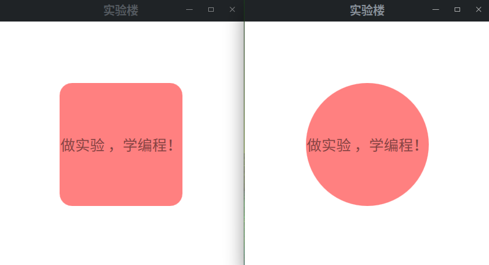

图　２-1（左)矩形+文字居中  | (右)圆形+文字居中

</div>

在前面介绍晚一些基本语法之后，我们用Rectangle类来绘制实验楼首页的header的背景色。
新建一个qml文件，取名为```Shiyanlouheaderback.qml```。

```css
//Shiyanlouheaderback.qml
import QtQuick 2.0
Item {
    Rectangle
    {
        width: parent.width
        height: 30
        color: "#F7F7F7"
    }
}

```

#### 2.2.2 Image

Image类是用来显示图片的，支持各种常见的图片格式。图片属于外部资源，我们需要在Qt中导入。这里我们已经提前准备好了资源文件夹image，请拷贝至我们的工程目录下面。

```文件 >> 新建文件或项目 >> 选择 Qt Resource File```
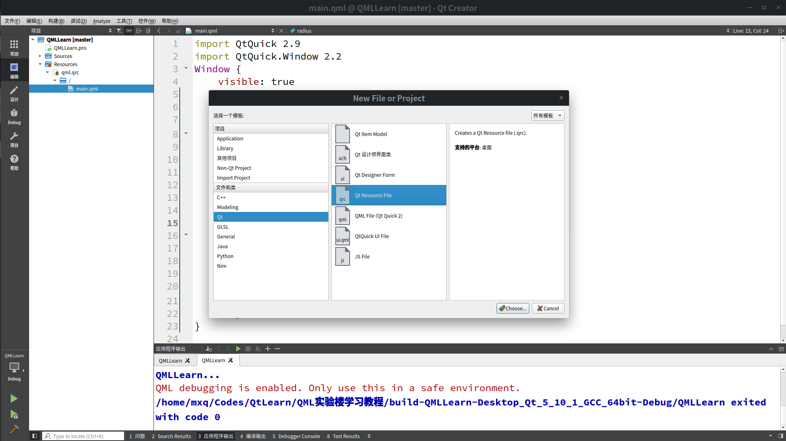
剩下的按照默认的选项即可。

左侧的项目栏窗口的Resources下面会出现一个image.qrc，旋转，右键 >> Add Exisiting Directory。选择提前准备的"image"文件夹，注意不要选择main.cpp。

创建文件```Shiyanloulogo.qml ```。

```css
//Shiyanloulogo.qml
import QtQuick 2.0
Item {
    // 显示实验楼logo
    Image {
        id: logoimg
        smooth: true
        visible: true
        source: "qrc:/image/shiyanlou_logo.svg"
        sourceSize: Qt.size(parent.size, parent.size)
        antialiasing: true
    }
    // 文字
    Text {
        id: logotext
        // 文字左侧紧邻图片的右侧
        anchors.left: logoimg.right
        // 设置间隔为10像素
        anchors.leftMargin: 10
        anchors.verticalCenter: logoimg.verticalCenter
        text: qsTr("做实验 ，学编程")
        font.pixelSize: 12
        color: "#4E4A59"
    }
}
```

下面演示制作一个圆形的登录的用户的圆形logo显示，将用到Rectangle和Image以及OpacityMask类。
这里添加了一个新库，QtGraphicalEffects 1.0。这个库主要是用来产生一些特效效果。
新建文件 ``` Shiyanlouuser.qml```。

```css
// Shiyanlouuser.qml
import QtQuick 2.0
import QtGraphicalEffects 1.0
Item {
    // 绘制一个圆形背景
    Rectangle {
            id: img
            width: 30
            height: 30
            radius: width/2
            color: "red"
    // 显示用户图片
    Image {
        id: _image
        smooth: true
        visible: false
        anchors.fill: parent
        source: "qrc:/image/user_logo.jpg"
        sourceSize: Qt.size(parent.size, parent.size)
        antialiasing: true
    }
    // 使用矩形遮盖
    Rectangle {
        id: _mask
        color: "black"
        anchors.fill: parent
        radius: width/2
        visible: false
        antialiasing: true
        smooth: true
    }
    // 使遮盖生效
    OpacityMask {
        id:mask_image
        anchors.fill: _image
        source: _image
        maskSource: _mask
        visible: true
        antialiasing: true
    }
}
}
```
效果图如下所示:
<div align=center>


图 2-2 圆形logo效果图

</div>

下面演示按钮的制作,按钮最简单的方法rectangle+Text。实现了简单的鼠标滑入按钮字体颜色改变，点击时会打印字符串的简单效果。
新建 ```Shiyanloucoursebtn.qml``` 文件
按钮的特殊之处就在于它和鼠标有交互，有悬停，有点击。
这里用的是 MouseArea，有很多属性在这里罗列一下。

|属性|描述|
|---|---|
|anchors.fill|鼠标作用区域|
|hoverEnabled|是否支持悬停特效|
|onEntered|鼠标进入时|
|onExited|鼠标离开时|
|onClicked|鼠标点击时|

```css
//Shiyanloucoursebtn.qml
import QtQuick 2.0
Item {
    // 按钮的背景
    Rectangle{
        id:coursebtnrect
        width: 50
        height: 25
        color: "#EFEFEF"
        radius: 5
        // 按钮上显示文字
        Text {
            id: coursetext
            anchors.centerIn: parent
            color: "#4E4A59"
            font.pixelSize: 12
            text: qsTr("我的课程")
        }
}
MouseArea{
    // 鼠标作用区域
    anchors.fill: coursebtnrect
    // 支持悬浮效果
    hoverEnabled: true
    // 鼠标滑入
    onEntered:
    {
        coursetext.color="green"
    }
    // 鼠标离开
    onExited: {
        coursetext.color = "#4E4A59"
    }
    // 鼠标点击
    onClicked:
    {
        console.log("点击了！")
    }
}
}

```
#### 2.2.3 Listview
Listview 有魔法般的特效。它通过设置一个代理模板，模板中的一些属性设置为变量，然后用一个模型文件来将这些变量值设为具体值，设置多组变量值就能够实现多个模板组成的列表，列表默认纵向显示，也可以设置为横向显示。这里实现了实验楼课程列表的纵向显示和楼+课程卡片的横向显示。

首先我们先实现一个模板文件```Shiyanloucourselistview.qml```，用来显示课程名称。
模板中设置了三个变量：coursetxt1，coursetxt2，coursetxt3。这三个变量是在模型文件中进行赋值，通过多组赋值就能实现多个模板形成的列表视图,注意这里的Item必须要设置width和height。
```css
//Shiyanloucourselistview.qml
import QtQuick 2.0
import QtQuick.Controls 2.2
Item {
    // 设置模板的高度和宽度
    width: 90
    height: 45
    Rectangle
    {
        id:listviewrect
        width:90
        height: 45
        color: "#337E9C"
        // 按行布局
        Row
        {
            anchors.verticalCenter: parent.verticalCenter
            // 第一个标题
            Text {
                id: subtext1
                width: 30
                text: coursetxt1
                font.pixelSize: 10
                color: "white"
                font.bold: true
            }
            // 第二个标题
            Text {
                id: subtext2
                width: 30
                font.pixelSize: 9
                color:"white"
                text: coursetxt2
            }
            // 第三个标题
            Text {
                id: subtext3
                width: 30
                font.pixelSize: 9
                color:"white"
                text: coursetxt3
            }
        }
    }
    // 文字下面的横向
    Rectangle{
        id:line
        anchors.bottom: listviewrect.bottom
        anchors.bottomMargin: 2
        width: 100
        height: 1
    }
}
```
单个模板的效果图如下:
<div align=center>

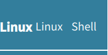

</div>

然后通过建立模型文件```Shiyanloucoursemodel1.qml```，可以快速地实现列表视图。在```ListModel```通过ListElement属性，将模板中的三个变量分别赋值。
ListModel支持动态交互，比如添加移除等这些操作在下一个实验将会介绍。
```css
//Shiyanloucoursemodel1.qml
import QtQuick 2.0
ListModel {
            id:courselistmodel
            ListElement {coursetxt1:"后端";coursetxt2:"Py";coursetxt3:"php"}
            ListElement {coursetxt1:"Linux";coursetxt2:"Linux";coursetxt3:"Shell"}
            ListElement {coursetxt1:"数据";coursetxt2:"Had";coursetxt3:"Spark"}
            ListElement {coursetxt1:"Web";coursetxt2:"HTML5";coursetxt3:"Web"}
}
```
最后将模板和模型通过ListView进行组合,具体代码在main.qml中。

```css
ListView{
            width: 90
            height: 400
            // 模型文件的id
            model:courselistmodel
            // 模板文件
            delegate:Shiyanloucourselistview{
            }
```
这样就会形成如下效果：
<div align = center>

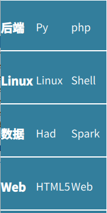

</div>

下面演示如何创建一个一个"楼+"课程介绍卡片。然后同样利用ListView方法实现多个卡片的显示。
先创建模板文件，```Shiyanloupluslistview.qml```。
卡片分上下两部分，为了实现图片的圆角效果，用了两个Rectangle，并且由于Rectangle的圆角不支持单一的设置，只能4个同时显示，所有用了两个小矩形进行遮盖。同样这里也有3个变量：上部分的背景色和“楼+”的字体颜色backcolor。上部分的文字upstr，下部分的文字bottomstr。

```css
//Shiyanloupluslistview.qml
import QtQuick 2.0
import QtGraphicalEffects 1.0
Item {
    width: 120
    height: 80
    // 上半部分矩形背景
    Rectangle
    {
        id:uprect
        width: 120
        height: 40
        radius: 5
        color:backcolor
        // 对上半部分的下标的圆角进行遮盖
        Rectangle
        {
            id:offbottom
            anchors.bottom: parent.bottom
            width: 120
            height: 5
            color:backcolor
        }
        // 圆形楼+ logo
        Rectangle
        {
            id:circlelogo
            anchors.left: parent.left
            anchors.leftMargin: 5
            anchors.verticalCenter: parent.verticalCenter
            color: "white"
            width: 30
            height: 30
            radius: 15
            // 圆形内文字
            Text {
                anchors.centerIn: parent
                color: backcolor
                id: louplustxt
                font.pixelSize: 12
                text: qsTr("楼 +")
            }
        }
        // 上半部分课程名称
        Text {
            id: rightmark
            anchors.verticalCenter: parent.verticalCenter
            anchors.left:circlelogo.right
            anchors.leftMargin: 8
            font.pixelSize: 11
            color: "#EFEFEF"
            font.bold: true
            text: upstr
        }
    }
    // 下半部分
    Rectangle
    {
        id:bottomrect
        anchors.top: uprect.bottom
        width: 120
        height: 40
        radius: 5
        color:"#EFEFEF"
        // 对下半部分的上面的圆角进行遮盖
        Rectangle
        {
            id:offup
            anchors.top: parent.top
            width: 120
            height: 5
            color:backcolor
        }
        // 下半部分课程名称
        Text {
            id: louplustxtsr
            anchors.centerIn: parent
            font.pixelSize: 11
            color: "#5D5D5D"
            text: bottomstr
        }
    }
}
```

创建模型文件```Shiyanloucoursemodel2.qml```和```Shiyanloucoursemodel3.qml```用来设定模板文件中的变量。
```css
//Shiyanloucoursemodel2.qml
import QtQuick 2.0
ListModel {
    id:courselistmodel2
    ListElement {backcolor:"#4B8FE0";upstr:"之 Python实战";bottomstr:"Python工程师"}
    ListElement {backcolor:"#5757B4";upstr:"之 Linux实战";bottomstr:"Linux工程师"}
}
```

```css
Shiyanloucoursemodel3.qml
import QtQuick 2.0
ListModel {
    id:courselistmodel3
    ListElement {backcolor:"#333950";upstr:"之 数据分析";bottomstr:"数据分析工程师"}
    ListElement {backcolor:"#271C62";upstr:"之 机器学习";bottomstr:"机器学习实战"}
}

```
效果如下所示:
<div align=center>

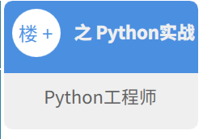

</div>

### 2.3 组件组合
至此需要的所有组件分别单个实现了，选择该将他们按照一定的布局进行拼接，需要的代码文件清单如下。

```shell
├── main.qml
├── Shiyanloucoursebtn.qml
├── Shiyanloucourselistview.qml
├── Shiyanloucoursemodel1.qml
├── Shiyanloucoursemodel2.qml
├── Shiyanloucoursemodel3.qml
├── Shiyanlouheaderback.qml
├── Shiyanloulogo.qml
├── Shiyanloupluslistview.qml
├── Shiyanlouuser.qml

```
修改```main.qml```文件。

```css
import QtQuick 2.9
import QtQuick.Window 2.2
import QtQuick.Controls 2.2
import QtQml.Models 2.1
Window {
    visible: true
    width: 340
    height: 215
    title: qsTr("实验楼")
    // 用来显示Header
    Shiyanlouheaderback{
    id:shiyanlouheaderback
    height: 30
    width: parent.width
        Item //包裹下面的元素
        {
            width: parent.width
            height: parent.height
            anchors.fill: parent
            anchors.verticalCenter: parent.verticalCenter
        // 通过横向划分行的方式布局元素
        Row
        {
            // 来自 Shiyanloulogo.qml文件
            Shiyanloulogo{
                width: 200
                height: 30
            }
            // 来自 Shiyanloucoursebtn.qml
            Shiyanloucoursebtn
            {
                height: 30
                width: 90
            }
            // 来自 Shiyanlouuser.qml
            Shiyanlouuser{
                id:shiyanlouuser
                width: 30
                height: 30
            }
        }
        }
    }
    //中间的课程listview
    Item
    {
        // 将中间部分的顶端设置为上面元素的底部，以此形成上下布局
        anchors.top: shiyanlouheaderback.bottom
        // 设置上边缘距离5像素
        anchors.topMargin: 5
        // 引入 模型文件 Shiyanloucoursemodel1.qml
        Shiyanloucoursemodel1
        {
            id:courselistmodel
        }
        // 引入 模型文件 Shiyanloucoursemodel2.qml
        Shiyanloucoursemodel2
        {
            id:courselistmodel2
        }
        // 引入 模型文件 Shiyanloucoursemodel3.qml
        Shiyanloucoursemodel3
        {
            id:courselistmodel3

        }
        // 通过横向划分行的方式将课程列表和楼+列表左右分开
        Row
        {
            spacing: 2
        ListView{
            width: 90
            height: 400
            // 引入模型的id
            model:courselistmodel
            // 引入代理模板文件Shiyanloucourselistview.qml
            delegate:Shiyanloucourselistview{
            }
        }
        // 通过纵向划分列的方式将形成两排楼+卡片
        Column
        {
            spacing: 10
        ListView
        {
            // 采用横向列表的形式，默认是纵向
            orientation:Qt.Horizontal
            // 列表间隔
            spacing: 5
            width: 300
            height: 80
            model: courselistmodel2
            delegate: Shiyanloupluslistview{
            }
        }
        // 另外一排楼+课程
        ListView
        {
            orientation:Qt.Horizontal
            spacing: 5
            width: 300
            height: 80
            model: courselistmodel3
            delegate: Shiyanloupluslistview{
            }
        }
        }
        }
}
}
```
确保所有的文件都实现后，点击Qt Creator中的绿色运行按钮就可以编译代码并打开程序。编译后的二进制文件在build文件夹中，也可以找到该文件夹直接打开二进制文件运行。

## 三，实验小结

通过本节实验，学习使用了QML基本的类，并且通过对这些类的组合和搭配了解到了QML的布局方式。希望同学能够用本节学习到的知识设计出更多好看实用的UI。下一节将会利用QML设计字幕拼接软件的UI，并介绍一些实用的QML自带函数，来完成基本的交互操作。

# 实验二 字幕拼接软件实现上 —— UI实现
## 一，实验内容
本次实验主要是通过QML实现字幕拼接软件的UI,还有一些基本的操作比如打开文件夹，关闭窗口，组件拖拽，模型文件列表值的多态更新等。

### 1.1 知识点

- QML布局

- QML自带的一些交互操作

- QML组件的位置的记录

- ListView动态更新

### 1.2 实验环境

- ubutun 16.04

- Qt 5.8

- Qt Creator

### 1.3 代码获取

### 1.4 目录结构

以下是```Zimu```文件夹的目录结构：
主要分为4个文件夹，basecom主要是一些基本的组件如按钮、直线、滑动条等。left中用来实现左侧的ListView用来显示导入的图片，形成一个图片列表。right 是用来显示拼接好的图片。main文件夹中有四个单独的文件，分别表示UI的四个区域。

```
basecom
│   ├── Button.qml
│   ├── Doublearrowline.qml
│   ├── Mainimglinedown.qml
│   ├── Mainshotbtn.qml
│   ├── Scaleslider.qml
│   ├── Shotchoose.qml
│   ├── Transform.qml
│   └── Windowbtn.qml
left
│   ├── Imagelistmodel.qml
│   ├── Imagelist.qml
│   └── Leftview.qml
right
│   └── Rightview.qml
 main
│   ├── Bottom.qml
│   ├── Main.qml
│   ├── Mid.qml
│   └── Top.qml
```
## 二，需求分析

### 2.1 布局分析

界面布局主要分为以下几个部分:

- 主窗口

- 顶部标题栏

- 左侧部分导入图片

- 中间右侧显示拼接图

- 底部按钮栏

将一些基础的组件单独实现，然后各个区域再利用这些组件进行组装。

### 2.2 功能实现分析

QML自带的功能可以实现图片的导入和显示，但是拼接操作需要对图片的像素进行操作，这个用C++实现比较好。QML实现前端的显示，C++实现图片剪切和拼接。最后C++将拼接好的图片传递到前端显示。本节将着重介绍前端的实现。

## 三，实现基础组件

### 3.1 创建工程
本小节介绍创建Zimu工程和导入需要的资源文件以及创建QML文件夹等准备工作。
#### 3.1.1 新建工程
新建工程，工程名称```Zimu```。

#### 3.1.2 导入需要的资源

导入需要的图片资源和字体资源。
在工程文件目录下准备icon和fonts两个文件资源文件夹。
选中```左侧目录的Resources >> 右键 >> 添加新文件 Qt Resource File```，分别命名ico和fonts。


然后```选中左侧目录的ico >> 右键 >> Add Existing Directory >> 选中icon文件夹```。这里需要注意，默认main.cpp也被选中，这里一定要把main.cpp文件前面的勾去掉。

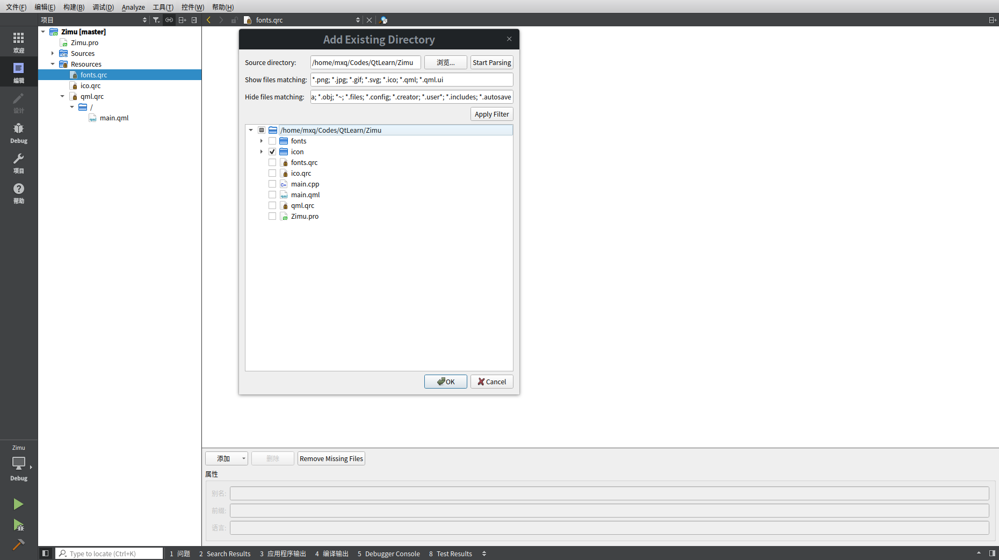

同理在fonts中导入fonts文件夹。
#### 3.1.3 创建QML文件夹

如果不创建文件夹进行管理，所有的qml文件都在一起没法区分。为了方便管理，安装功能划分多个文件夹。

Qt没有自带创建文件夹的功能，有很多其他方式可以实现，这里用一个我常用的方式。

在工程目录文件中手动创建四个文件夹，分别命名：```basecom```、```left```、```right```、```main```。里面分别放入一个空文件命名为```test.qml```

然后通过```Add Existing Directory```的方式将这五个文件夹添加进入qml资源。

在main文件夹下面创建一个Main.qml文件。
将脚手架的自带的main.qml文件中的代码覆盖到Main.qml中。
同时修改main.cpp中main.qml文件路径。

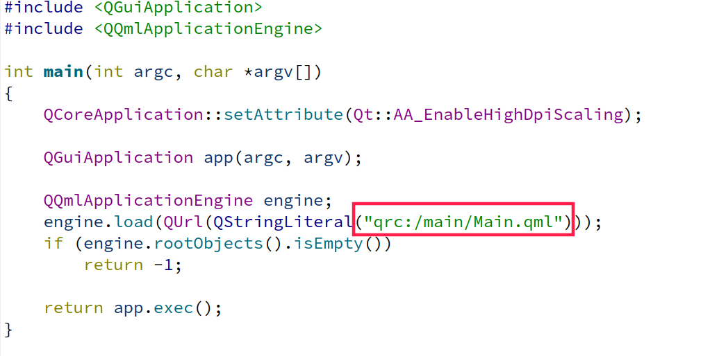

当每一个文件夹中都创建了新的文件后，test.qml文件可以删除，如果文件夹中只有test文件不能删除。

最终创建的工程目录的界面如下所示:

<div align=center>

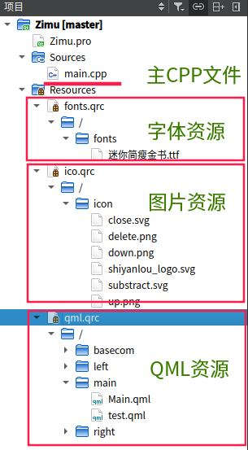

</div>

### 3.2 实现基础组件

basecom文件夹下存放所有的基础组件，清单如下：

```
├── Button.qml
├── Doublearrowline.qml
├── Mainimglinedown.qml
├── Mainshotbtn.qml
├── Scaleslider.qml
├── Shotchoose.qml
├── Transform.qml
└── Windowbtn.qml
```

主要包括按钮，最大化最小化按钮，调整图片大小的线条，缩放图片尺寸的滑动条等。

#### 3.2.1 基础按钮

<div align=center>

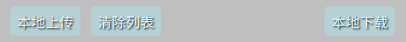

</div>

首先介绍基础按钮的实现，在basecom文件夹下创建```Button.qml```文件。
这里我们定义了一个基础按钮，按钮上面的文字和按钮的点击功能函数都需要引入时具体的实例化。比如上传按钮和下载按钮，两个按钮的文字和功能都不一样，但是其他效果都一样。在实现这两个按钮时只需要修改这两个不一样的参数即可。

```css
\\ Zimu\basecom\Button.qml
import QtQuick 2.0
import QtGraphicalEffects 1.0
import QtQuick.Controls.Material 2.0
Item {
    // 定义一个全局变量用来显示按钮上面的文字
    property string buttonlabel: ""
    // 定义一个信号，用来单独实现触发函数。
    signal buttonClicked
    id:uploadordownload
    // 按钮背景
    Rectangle
    {
        width: 60
        height: 25
        color: "#AEDDE3"
        radius: 3
        opacity: 0.6
        id:backbtn
        Material.accent: Material.Orange

    }
    // 显示文字
    Text {
        id: buttontext
        opacity: 0.1
        anchors.centerIn: backbtn
        font.pixelSize: 12
        color: "white"
        text: qsTr(buttonlabel)
    }
    // 鼠标效果
    MouseArea
    {
        anchors.fill: backbtn
        hoverEnabled: true
        // 滑入划出效果
        onEntered:
        {
            backbtn.opacity = 1
            buttontext.opacity = 1
        }
        onExited:
        {
            backbtn.opacity = 0.6
            buttontext.opacity = 0.1
        }
        // 点击事件，依据buttonClicked的实现而有不同的效果
        // 如上传图片和下载图片两个按钮就各自实现不同的点击函数
        onClicked:
        {
            uploadordownload.buttonClicked()
        }
    }
    // 影音特效
    DropShadow {
            anchors.fill: buttontext
            horizontalOffset: 1
            verticalOffset: 1
            radius: 8.0
            samples: 30
            color: "#082532"
            source: buttontext
        }
}
```

#### 3.2.2 图片字幕控制直线

<div align=center>

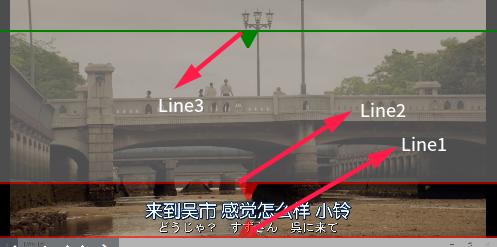

</div>

新建```Doublearrowline.qml```文件用来实现控制字幕宽度的两条直线，通过拖拽上下两条直线来控制字幕的位置，这里面主要是记录两个变量```position1```和```position2```，这两个变量是全局变量在```Main.qml```中进行定义的。
```css
//Zimu/basecom/Doublearrowline.qml
import QtQuick 2.0
Item {
    // 定义两个全局的整形变量，表示字幕的上线和下线的宽度
    property int arrowlinewidth: 1 //>=1
    property int arrowlinewidth2: 9 //>=1
    // 通过Canvas 来绘制字幕的上面的一条直线
    Canvas
    {
        id:moveline1
        opacity:0.6
        width: mainwindowwidth/2 - 30
        height: 9
        y:mainRoot.position1
        onPaint:
        {
            var ctx = getContext("2d")
            var arrowwidth = mainwindowwidth/2 - 30
            ctx.fillStyle = "red"
            ctx.beginPath()
            ctx.moveTo(0,arrowlinewidth)
            ctx.lineTo(arrowwidth/2-5,arrowlinewidth)
            ctx.lineTo(arrowwidth/2,arrowlinewidth+9)
            ctx.lineTo(arrowwidth/2+5,arrowlinewidth)
            ctx.lineTo(arrowwidth,arrowlinewidth)
            ctx.lineTo(arrowwidth,arrowlinewidth-1)
            ctx.lineTo(0,arrowlinewidth-1)
            ctx.closePath()
            ctx.fill()
        }
    }
    // 实现鼠标上下拖拽效果，并记录位置 position1
    MouseArea {
                cursorShape: Qt.SizeVerCursor
                anchors.fill: moveline1
                drag.target: moveline1
                drag.axis: Drag.YAxis
                drag.minimumY: 0
                drag.maximumY: moveline2.y+8
                onPositionChanged:
                {
                    mainRoot.position1=moveline1.y
                }
            }
    // 同理实现了字幕的下面一条直线
    Canvas
    {
        id:moveline2
        opacity:0.6
        width: mainwindowwidth/2 - 30
        height: 10
        y:mainRoot.position2
        onPaint:
        {
            var ctx = getContext("2d")
            var arrowwidth = mainwindowwidth/2 - 30
            ctx.fillStyle = "red"
            ctx.beginPath()
            ctx.moveTo(0,arrowlinewidth2)
            ctx.lineTo(arrowwidth/2-5,arrowlinewidth2)
            ctx.lineTo(arrowwidth/2,arrowlinewidth2-9)
            ctx.lineTo(arrowwidth/2+5,arrowlinewidth2)
            ctx.lineTo(arrowwidth,arrowlinewidth2)
            ctx.lineTo(arrowwidth,arrowlinewidth2+1)
            ctx.lineTo(0,arrowlinewidth2+1)
            ctx.closePath()
            ctx.fill()
        }
    }
    // 拖拽直线，记录直线的位置position2
    MouseArea {
                cursorShape: Qt.SizeVerCursor
                anchors.fill: moveline2
                drag.target: moveline2
                drag.axis: Drag.YAxis
                drag.minimumY: moveline1.y-8
                drag.maximumY: parent.height-10
                onPositionChanged:
                {
                    mainRoot.position2=moveline2.y
                }
            }
}
```
与之类似的还有一个文件，```Zimu/basecom/Mainimglinedown.qml```是用来对主视图进行截图的，它更新变量```mainposition```，代码可以在源文件中进行查看。

#### 3.2.3 图片的顺序挑战和删除以及主图按钮

<div align=center>

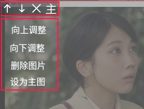

</div>

创建```Shotchoose.qml```文件。三个带图标的按钮:向上，向下,删除的格式都是图标加点击效果。所以这三个按钮在具体实现时都以 Shotchoose为模板，修改图标路径和信号函数。
```
// Zimu/basecom/Shotchoose.qml
import QtQuick 2.0
Item {
    // 变量用来设置显示图标路径
    property string shotoperationicourl: "qrc:icon/delete.png"
    // 用来改变透明度
    property real opacityvalue: 0.5
    // 点击信号
    signal buttonClicked
    id:windowbtn
    // 背景
    Rectangle
    {
        id:icoback
        width: 15
        height: 15
        color: "#32373B"
        opacity: opacityvalue
    }
    // 图标
    Image {
        anchors.centerIn: icoback
        width: 12
        height: 12
        id: shotsoperationico
        source: shotoperationicourl
    }
    // 鼠标效果
    MouseArea
    {
        anchors.fill:icoback
        hoverEnabled: true
        onClicked:
        {
            windowbtn.buttonClicked()
        }
        onEntered:
        {
          icoback.opacity = 1
        }
        onExited: {
            icoback.opacity = opacityvalue
       }

    }
}
```
主图按钮是用来将一张图标设置为主图，可以显示图片字幕以外的部分。因为其格式和其他三个稍有不同，所有又单独创建了一个文件，命名为```Mainshotbtn.qml```，具体实现创建源码```Zimu/basecom/Mainshotbtn.qml```。
#### 3.2.4 滑动条控制显示图片大小

<div align=center>

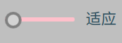

</div>

由于本程序使用了固定窗口大小，最后预览生成的拼接图可能无法放大，这里使用了一个滑动条设置了三个大小来改变图片大小，当图片超过窗口时会有上下左右的滚动条滚动显示。这里主要是通过改变滑动条的值改变```sourcewidth```，视图会根据```sourcewidth```的值来显示图片的大小。
```sourcewidth```是在main.qml中定义的。

```css
// Zimu/basecom/Scaleslider.qml
import QtQuick 2.0
import QtQuick.Controls 1.4
import QtQuick.Controls.Styles 1.4
Item {
    // 控制滑动条上面显示的文字
    property string promptstr: "适应"
    // 创建滑动条
    Slider {
        anchors.leftMargin: 5
        maximumValue: 2
        minimumValue: 0
        stepSize:1
        style: SliderStyle {
            groove: Rectangle {
                implicitWidth: 50
                implicitHeight: 3
                color: "pink"
                radius: 1
            }
            handle: Rectangle {
                anchors.centerIn: parent
                color: control.pressed ? "purple" : "lightgray"
                border.color: "gray"
                border.width: 2
                implicitWidth: 12
                implicitHeight: 12
                radius: 6
            }
        }
        Text {
            id: promptstrid
            anchors.left: parent.right
            anchors.verticalCenter: parent.verticalCenter
            anchors.leftMargin: 8
            font.pixelSize: 11
            text: qsTr(promptstr)
            color:"#274A59"
        }
        // 随着滑动条的值改变，改变显示图像的大小
        onValueChanged:
                {
                    if(value === 0)
                    {
                        promptstr="适应"
                        // 适应，按照UI设定的窗口显示
                        sourcewidth = mainwindowwidth/2 - 30
                    }
                    else if (value === 1)
                    {
                        // 放大，UI窗口的二倍大小
                        promptstr="半倍"
                        if(myshotinfo.sourcewidth !==0)
                        {
                        sourcewidth = myshotinfo.sourcewidth / 2
                        }
                    }
                    else
                    {
                        promptstr="原画"
                        if(myshotinfo.sourcewidth !==0)
                        {
                          // 原图显示
                          sourcewidth = myshotinfo.sourcewidth
                        }
                    }
                }
    }
}
```
#### 3.2.5 窗口大小和拼接转换

如下图是转换按钮，用来对调整后的字幕图片触发拼接操作，当左侧没有显示图片时，按钮是暗色的，表示不能进行转换操作。当上传完图片后，可以对图片字幕进行拼接，按钮为亮色。

<div align=center>


</div>

```css
// Zimu/basecom/Transform.qml
import QtQuick 2.0
import QtGraphicalEffects 1.0
Item {
    // 定义初始的按钮颜色
    property string transformbuttoncolor: "yellow"
    property string transformarrowcolor: "#2EC14A"
    property int transformicowidth: 28
    property int  transformradius: 28
    Rectangle
    {
        id:backcircle
        opacity: mainRoot.transformbtnopacity
        width: transformicowidth
        height: transformicowidth
        radius: transformradius
        color:transformbuttoncolor
    }
    // 绘制箭头
    Canvas
    {
        anchors.centerIn: backcircle.Center
        id:arrowid
        opacity:mainRoot.transformbtnopacity
        width: transformicowidth
        height: transformicowidth
        onPaint:
        {
            var ctx = getContext("2d")
            var arrowwidth = transformicowidth
            ctx.fillStyle = transformarrowcolor
            ctx.beginPath()
            ctx.moveTo(arrowwidth/6,arrowwidth/3)
            ctx.lineTo(arrowwidth*3/7,arrowwidth/3)
            ctx.lineTo(arrowwidth*3/7,arrowwidth/6)
            ctx.lineTo(arrowwidth*5/6,arrowwidth/2)
            ctx.lineTo(arrowwidth*3/7,arrowwidth*5/6)
            ctx.lineTo(arrowwidth*3/7,arrowwidth*2/3)
            ctx.lineTo(arrowwidth/6,arrowwidth*2/3)
            ctx.closePath()
            ctx.fill()
        }
    }
    DropShadow {
            anchors.fill: arrowid
            horizontalOffset: 2
            verticalOffset: 2
            radius: 8.0
            samples: 40
            color: "#082532"
            source: arrowid
        }
    MouseArea
    {
        anchors.fill: backcircle
        hoverEnabled: true
        onClicked:
        {
            if(mainRoot.picdownloaded && imagemodellist.rowCount()>0)
            {
                //加载图片完毕，并且可用的图片数目大于0
                //mainRoot.transformimgvisiavle = !mainRoot.transformimgvisiavle
                var i = 0
                myshotinfo.imgurls = []
                // 将图片列表传入c++中的imgurl数组中
                for(;i<imagemodellist.count;i++)
                {
                   var tempurl = imagemodellist.get(i).shoturl
                   var tempcolor = imagemodellist.get(i).mainrectcolor
                   if(tempcolor === "yellow")
                    {
                        myshotinfo.mainindex = i
                    }
                   myshotinfo.imgurls[i]= tempurl
                }
                // 触发c++ 进行图片拼接
                myshotinfo.setImage(sourcewidth,position1,position2+9,mainposition)
            }
        }
    }
}
```
还有两个按钮用来关闭窗口和最小化窗口，代码格式固定就不放这里介绍了。具体参见```Zi\basecom\Windowbtn.qml```。
## 四，图片显示相关
### 4.1 左侧导入图片列表实现
图片列表是通过ListView实现，先创建模板文件：
```Zimu\left\Imagelist.qml```。对于不同的文件夹中的qml文件需要在开始的地方导入进来，格式为```import 文件夹路径 as 简写名称```。引入文件夹中的某一个文件时，使用点符合。
模板文件主要是实现了显示一张图片，三条控制线和4个按钮组合一起。这里面有2个全局变量。```imagemodellist```是模型文件的id。用来设置图片的url和设置主图按钮的颜色。```imagemodellist```是一个列表，在调整图片顺序和删除图片时修改了```imagemodellist```的url元素，就能实现图片顺序和显示的更新。修改```imagemodellist```的```mainrectcolor```。就能实现设置主图按钮颜色的切换。同时记录了主图的索引```mainshotindex```，这个信息在剪切图
片时会用到。

模板的效果图如下:

<div align=center>

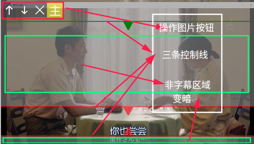

</div>

```css
//Zimu/left/Imagelist.qml
import QtQuick 2.0
import "../basecom" as Com // 导入其他文件夹中的文件
Item {
    // 用作listview所有必须设置Item的高度和宽度
    width:mainwindowwidth/2 - 30
    height: shotimage.height
    Image {
        id: shotimage
        width:mainwindowwidth/2 - 30
        smooth: true
        // 图片的路径设置为变量，在模型文件中进行赋值
        source: shoturl
        // 图片的显示大小设置为与保持长宽比
        fillMode: Image.PreserveAspectFit
        // 图片上方显示控制字幕的直线
        Com.Doublearrowline
        {
            anchors.fill: parent
        }
    }
    // 通过矩形来形成字幕上直线的灰色显示效果
    Rectangle
    {
        width:mainwindowwidth/2 - 30
        height: position1
        color: "gray"
        opacity: 0.6
    }
    // 控制主视图直线
    Com.Mainimglinedown
    {
        anchors.fill: parent
        visible: mainRoot.mainshotindex === index ? true:false
    }
    //四个按钮
    Item
    {
       anchors.fill: shotimage
       // 通过划分行的方式进行布局
       Row
       {
           // 向上调整按钮
           //引入Shotchoose
           Com.Shotchoose
           {
               width: 15
               height: 15
               //设定图片路径
               shotoperationicourl: "qrc:icon/up.png"
               // 如果是第一个图片，则没有向上调整按钮，设置可见性为false
               visible: index ==0 ? false:true
               onButtonClicked:
               {
               // 非第一张图片时进行向上移动
               if(index > 0)
               {
               // 交互相邻的图片的shorturl。
               var tempurl = imagemodellist.get(index).shoturl
               var tempcolor = imagemodellist.get(index).mainrectcolor
               var oldcolor = imagemodellist.get(index-1).mainrectcolor
               imagemodellist.setProperty(index, "shoturl", imagemodellist.get(index-1).shoturl)
               imagemodellist.setProperty(index-1,"shoturl",tempurl)
               imagemodellist.setProperty(index,"mainrectcolor",oldcolor)
               imagemodellist.setProperty(index-1,"mainrectcolor",tempcolor)
               //图片是主图时
               if(mainRoot.mainshotindex === index)
               {
                   //主图的索引-1
                   mainRoot.mainshotindex -=1
               }
               //主图是上一张图片时
               else if(mainRoot.mainshotindex === index+1)
               {
                   //主图索引+1
                   mainRoot.mainshotindex +=1
               }
               }
               console.log(mainRoot.mainshotindex)
               }
           }
           //向下调整顺序
           //引入Shotchoose
           Com.Shotchoose
           {
               width: 15
               height: 15
               //设定图标路径
               shotoperationicourl: "qrc:icon/down.png"
               //visible: index === imagemodellist.rowCount()-1 ? false:true
               visible: index === urlcounts-1 ? false:true
               //向下移动,交换和向上交互差不多
               onButtonClicked:
               {
                   if(index < imagemodellist.rowCount())
                   {
                   var tempurl = imagemodellist.get(index).shoturl
                   var tempcolor = imagemodellist.get(index).mainrectcolor
                   var oldcolor = imagemodellist.get(index+1).mainrectcolor
                   imagemodellist.setProperty(index, "shoturl", imagemodellist.get(index+1).shoturl)
                   imagemodellist.setProperty(index+1,"shoturl",tempurl)
                   imagemodellist.setProperty(index,"mainrectcolor",oldcolor)
                   imagemodellist.setProperty(index+1,"mainrectcolor",tempcolor)
                   if(mainRoot.mainshotindex === index)
                   {
                       mainRoot.mainshotindex = mainRoot.mainshotindex+1
                   }
                   else if(mainRoot.mainshotindex === index+1)
                   {
                       mainRoot.mainshotindex -=1

                   }
                   }
                   console.log(mainRoot.mainshotindex)
               }
           }
           Com.Shotchoose
           {
               width: 15
               height: 15
               onButtonClicked:
               {
                  //删除当前图片
                   if(imagemodellist.rowCount()-1===0)
                   {
                       mainRoot.transformbtnopacity = 0.5
                       imagemodellist.remove(index,1)
                       urlcounts -= 1
                   }
                   else if(imagemodellist.rowCount()-1>0)
                   {
                       if(mainRoot.mainshotindex !== index)
                       {
                        //删除的图片的索引小于主图索引
                       if(mainRoot.mainshotindex > index)
                       {
                           imagemodellist.remove(index,1)
                           urlcounts -= 1
                           imagemodellist.setProperty(mainRoot.mainshotindex-1, "mainrectcolor","yellow")
                           mainRoot.mainshotindex -= 1
                       }
                       //删除的图片的索引大于主图索引
                       else
                       {
                           imagemodellist.remove(index,1)
                           urlcounts -= 1
                       }
                       }
                       else
                       {
                           imagemodellist.remove(index,1)
                           urlcounts -= 1
                           imagemodellist.setProperty(0, "mainrectcolor","yellow")
                           mainRoot.mainshotindex = 0
                       }
                   }
                   else
                   {
                       imagemodellist.remove(index,1)
                       urlcounts -= 1
                   }
                   console.log(mainRoot.mainshotindex)
               }
           }
           // 主图按钮
           Com.Mainshotbtn
           {
               width: 15
               height: 15
               changecolor:mainrectcolor
               onButtonClicked:
               {
                   if(mainRoot.mainshotindex !== index)
                   {
                   //点击选择的主图按钮，将主图按钮的颜色改变，全局变量mainindex也相应的改变。
                   imagemodellist.setProperty(mainRoot.mainshotindex, "mainrectcolor","#32373B")
                   imagemodellist.setProperty(index, "mainrectcolor","yellow")
                   mainRoot.mainshotindex = index
                   }
                   console.log(mainRoot.mainshotindex)
               }
           }
       }
    }

    //图片的矩形罩盖2
    //将字幕下面的控制直线的下面部分用灰色遮盖
    Rectangle
    {
        width:mainwindowwidth/2 - 30
        y:mainRoot.position2 + 10
        anchors.bottomMargin: 10
        height: shotimage.height - position2 - 9
        color: "gray"
        opacity: 0.6
    }

}
```
创建模型文件```Imagelistmodel.qml```，很简单，因为是动态设置，这里不需要任何的变量设定。这里介绍一下ListModel支持的操作。因为这些操作都分部在不同的文件中，举例中都是从不同文件中直接摘录的代码。

|操作|描述|举例|
|---|---|---|
|get|获取列表中的元素值|```imagemodellist.get(index).mainrectcolor```|
|setProperty|设置指定元素的属性值|```imagemodellist.setProperty(index, "shoturl", imagemodellist.get(index+1).shoturl)```|
|append|向列表中添加元素|```imagemodellist.append({"shoturl":urls[i]} ```|
|clear|清空列表|```imagemodellist.clear()```|
|remove|移除元素|```imagemodellist.remove(index,1)```|
|rowCount|返回列表元素的个数|```imagemodellist.rowCount()```|

```css
// Zimu/left/Imagelistmodel.qml
import QtQuick 2.0
//代理model
ListModel {
    id:imagemodellist
}
```
在left文件夹下创建```Leftviewq.qml```文件,通过Listview实现图片列表。
```css
// Zimu/left/Leftview.qml
import QtQuick 2.0
import QtQuick.Window 2.2
import QtQuick.Controls 2.1
import QtQml.Models 2.1
Item {
    // 设定图片列表的显示区域与背景
    Rectangle
    {
        id:backrec
        radius: 3
        opacity: 0.5
        color: "#74E1FF"
        width: mainwindowwidth/2 - 30
        height: mainwindowheight-60
    }
    Item
    {
        // 将图片列表的显示区域限定在backrec中
        anchors.fill: backrec
        width: mainwindowwidth/2 - 30
        height:mainwindowheight-60
        clip: true
        ListView
        {
            id:showshotimage
            width: mainwindowwidth/2 - 30
            height:mainwindowheight-60
            model: imagemodellist // 代理模型，初始没有任何元素，没有图片显示
            highlightFollowsCurrentItem: true
            focus: true
            delegate: Imagelist
            {
            }
            // 支持超出大小出现滚动条
            ScrollBar.vertical: ScrollBar
            {
                    id:hbar
                    parent: showshotimage
                    hoverEnabled: true
                    active: hovered || pressed
                    orientation: Qt.Vertical
                    anchors.top: showshotimage.top
                    anchors.left: showshotimage.right
                    anchors.bottom: showshotimage.bottom
                }
        }
    }
}
```

### 4.2 右侧显示拼接图片

右侧的图片是通过c++传递过来,用到了Connections属性。
```css
// Zimu/right/Rightview.qml
import QtQuick 2.0
import QtQuick.Controls 2.1
import QtQuick.Window 2.10
import QtQuick.Controls 2.3
import QtQuick.Controls.Material 2.0
import QtQuick.Layouts 1.3
Item {
    Item {
        //图片显示背景
        Rectangle
        {
            id:rightback
            radius: 3
            opacity: 0.5
            color: "#74E1FF"
            width: mainwindowwidth/2 - 30
            height: mainwindowheight-60
        }
        //设定支持滚动条显示
        ScrollView{
            id:showconcate
            width: sourcewidth
            height:mainwindowheight-60
            clip: true
            contentWidth :sourcewidth//根据图片大小进行缩放scrollbar
            anchors.fill:rightback
            anchors.centerIn: rightback
            // 显示图片
            Image {
                anchors.centerIn: parent
                id:concantnateimg
                smooth: true
                width: sourcewidth
                fillMode: Image.PreserveAspectFit
                source: ""
                // 用于连接c++显示
                Connections {
                        target: myshotinfo  // 目标对象
                        onCallQmlRefeshImg: {
                            concantnateimg.source=""
                            concantnateimg.source= "image://diffurls"
                        }
                }
        }
        }
    }
    }
```
## 五，按钮相关操作

底部有三个按钮分别实现不同的功能。这里放在一个文件中实现。
新建文件 ```Bottom.qml```。上传图片按钮主要是通过打开文件夹选则图片文件后，向```imagemodellist```中添加了图片url元素，这样```imagemodellist```就不是空列表，ListView也会立刻更新显示，同时转换按钮的透明度为会更高表示此时可以进行拼接操作。清除列表按钮会清除列表元素，同时左侧的图片也会消失，转换按钮也会变暗表示拼接操作被禁用。本地下载按钮是用来选择图片保存路径，并通过调用c++的保存图片函数，保存相应大小格式的图片。

```css
//Zimu/main/Bottom
import QtQuick 2.9
import QtQuick.Dialogs 1.0
import QtQuick.Controls.Material 2.0
import "../basecom" as Com
Item {
    // 数组urls用来记录选择的图片的路径
    property variant urls: []
    // 按行布局
    Row
    {
        // 打开文件操作
        FileDialog
        {
            id:fds
            title: "选择图片文件"
            folder: shortcuts.desktop
            selectExisting: true
            selectFolder: false
            selectMultiple: true // 支持多选
            nameFilters: ["图片 (*.jpg|*.jpeg|*.png|*.svg)"]
            // 选择了文件之后
            onAccepted: {
                // urls被赋值为图片路径
                urls = fds.fileUrls
                myshotinfo.imgurl = urls[0]
                // 通过c++ 代码返回图片的宽度和长度的比例
                var widthheigthbili = myshotinfo.imgscaleheight
                // 返回图片高度
                var imgheight = (mainwindowwidth/2 - 30) / widthheigthbili
                // 字幕控制线1的初始位置为图片的4/5
                mainRoot.position1 = imgheight *4/5
                // 字幕控制线2的初始位置为距离图片底部10像素
                mainRoot.position2 = imgheight - 10
                var i = 0
                // 将imagemodellist中的shoturl和mainrectcolor赋值
                for(;i<urls.length;i++)
                {
                    if(i===0 && urlcounts===0)
                    {
                        imagemodellist.append({"shoturl":urls[i],"mainrectcolor":"yellow"})
                    }
                    else
                    {
                    imagemodellist.append({"shoturl":urls[i],"mainrectcolor":"#32373B"})
                    }
                }
                // 图片加载完毕
                mainRoot.picdownloaded = true
                // 设置转换按钮的透明度1
                mainRoot.transformbtnopacity = 1.0
                // 记录图片文件数组的长度
                urlcounts += urls.length
            }
        }
        Item
        {
            height: mainwindowheight-60
            width: 10
        }
        Item
        {
            height:40
            width: mainwindowwidth/2 - 30
        Item
        {
            anchors.centerIn: parent
        // 本地上传按钮
        Com.Button
        {
            width: 60
            height: 25
            anchors.verticalCenter: parent.verticalCenter
            x:(mainwindowwidth/2 - 30)/8 - 100
            buttonlabel: "本地上传"
            onButtonClicked:
            {
                // 点击时打开文件夹相关操作
                fds.open()
            }

        }
        // 清除列表操作
        Com.Button
        {
            width: 60
            height: 25
            anchors.verticalCenter: parent.verticalCenter
            buttonlabel: "清除列表"
            onButtonClicked:
            {
                // 清除imagemodellist
                imagemodellist.clear()
                // 转换按钮的透明度降低
                mainRoot.transformbtnopacity = 0.5
                // 主图index = 0
                mainshotindex = 0
                // 图片路径数组长度为0
                urlcounts = 0
            }
        }
        }
        }
        Item
        {
            height: mainwindowheight-60
            width: 36
        }

        Item
        {
            height:40
            width: mainwindowwidth/2 - 30
        // 选择保存图片的路径
        FileDialog {
            id: folderchoose
            title: "选择保存路径"
            selectFolder : true
            folder: shortcuts.desktop
            selectExisting: false
            selectMultiple: false
            nameFilters: ["图片 (*.jpg|*.jpeg|*.png|*.svg)"]
            onAccepted: {
                // 调用c++代码中的保存图片函数
                myshotinfo.saveImage(folderchoose.fileUrl,sourcewidth);
            }
            onRejected: {
            }
        }
        // 本地下载按钮
        Com.Button
        {
            width: 60
            height: 25
            anchors.verticalCenter:parent.verticalCenter
            x:mainwindowwidth/4 - 100
            buttonlabel: "本地下载"
            onButtonClicked:
            {
                if(myshotinfo.sourcewidth >0)
                {
                 //保存图片
                folderchoose.open()
                }
            }

        }
        // 调整显示图片大小的滑动条
        Com.Scaleslider
        {
            height:12
            width: 10
            anchors.verticalCenter: parent.verticalCenter
            x:mainwindowwidth/4
        }
        }
    }

}
```
## 六，实验小结

本次实验介绍了许多QML的组件的操作，大部分都是qml的基础语法，少许用到了一些判断，循环等操作。对于如何与后台进行数据交互还没有进行说明，下一节将介绍C++相关的代码。
# 实验三 字幕拼接软件实现下 —— C++实现图片拼接

## 一，实验内容
本实验将在上一次实验的基础上，介绍C++与QML的交互方式，并实现C++动态刷新前端的拼接字幕的图片。会梳理前端一些与后台C++交互的地方，最后完成整个项目。

### 1.1 实验知识点

- C++ 基础知识

- Qt 编程

### 1.2 实验环境

- ubuntu 16.04

- Qt 5.8

- Qt Creator

## 二，C++ 后台实现

### 2.1 imageprovider.h

首先创建头文件```getshotinfo.h```。

<div align=center>

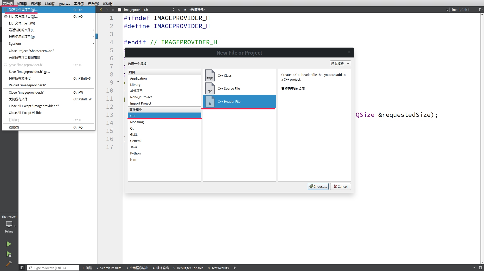

</div>

QQuickImageProvider类提供了一个用于在QML中支持像素映射和线程化图像请求的接口。

因为是一个接口所有只需要实现一个请求函数即可。

```c++
// Zimu/imageprovider.h
#ifndef IMAGEPROVIDER_H
#define IMAGEPROVIDER_H

#endif // IMAGEPROVIDER_H
#include <QObject>
#include <QQuickImageProvider>
#include <QImage>
#include <QSize>
class ImageProvider : public QQuickImageProvider
{
public:
    ImageProvider();
    QImage requestImage(const QString &id, QSize *size, const QSize &requestedSize);
    QImage img;

};
// Zimu/imageprovider.cpp
#include "imageprovider.h"
#include<QDebug>
ImageProvider::ImageProvider()
    : QQuickImageProvider(QQuickImageProvider::Image)
{
}
QImage ImageProvider::requestImage(const QString &id, QSize *size, const QSize &requestedSize)
{
    return img;
}
```
ImageProvider 类有一个数据成员img。下面我们就通过另一个类来操作这个数据成员，从而实现字幕的拼接和前端的更新。
### 2.2 getshotinfo.h

下面介绍我们从前端获取数据的和实现字幕拼接的代码。


 Q_PROPERTY()是一个宏，用来在一个类中声明一个属性property，由于该宏是qt特有的，需要用moc进行编译，故必须继承于QObject类。这里我们用Q_PROPERTY()设置一些变量的只读和写入属性。比如，我们需要在qml中写入图片的路径，同时可以通过只读属性返回其值。

 signals是用来触发信号，当c++完成图片字幕的拼接后就触发信号来更新前端视图。这里定义的```callQmlRefeshImg()```和```Zimu\right\Rightview.qml第38~44行对应```。
 ```css
 Connections {
                target: myshotinfo  // 目标对象
                onCallQmlRefeshImg: {
                    concantnateimg.source=""
                    concantnateimg.source= "image://diffurls"
                }
                }
 ```
slots是用来被前端调用，这里定义了两个函数```setImage```和```saveImage```,这两个函数分别被前端的转换按钮和下载图片按钮调用。

```c++
// Zimu/getshotinfo.h
#ifndef GetSHOTINFO_H
#define GetSHOTINFO_H
#endif // GetSHOTINFO_H
#include<QVector>
#include<QObject>
#include<QDebug>
#include<QImage>
#include<imageprovider.h>
// 定义类
class Shotinfo:public QObject
{
    Q_OBJECT
    // 定义imgurl的只读属性imgurl,可写属性setImgurl
    Q_PROPERTY(QString imgurl READ imgurl WRITE setImgurl)
    // 定义imgurls的只读属性imgurls,可写属性setImgurls
    Q_PROPERTY(QVector<QString> imgurls READ imgurls WRITE setImgurls)
    // 定义 mainindex的只读属性mainindex，可写属性setMainindex
    Q_PROPERTY(int mainindex READ mainindex WRITE setMainindex)
    // 定义sourcewidth的只读属性sourcewidth
    Q_PROPERTY(int sourcewidth READ sourcewidth)
    // 定义imgscaleheight的只读属性imgscaleheight
    Q_PROPERTY(double imgscaleheight READ imgscaleheight)
signals:
    // 定义一个信号，用来触发前端刷新视图
    void callQmlRefeshImg();
public:
    // 构造函数
    explicit Shotinfo(QObject *parent = 0);
    // 析构函数
    ~Shotinfo();
    // 用来保存图片的url
    QString imgurl();
    // 用来保存图片宽度
    int sourcewidth();
    // 用来设置图片url
    void setImgurl(QString &imgurl);
    // 用来保存图片路径的向量
    QVector<QString> imgurls();
    // 用来设置图片路径向量
    void setImgurls(QVector<QString> &imgurls);
    // 用来保存主图索引
    int mainindex();
    // 用来设置主图索引
    void setMainindex(int &mainindex);
    // 用来保存图片高度
    double imgscaleheight();
    // 用来设置图片的高度
    Q_INVOKABLE void setHeight();
    // ImageProvider向前端提供图片
    ImageProvider *m_pImgProvider;

public slots:
    void setImage(int scaledwidth,double pos1,double pos2,double mainposition);
    void saveImage(QString saveurl,int scaled);
private:
    QString myimgurl;
    QVector<QString> myimgurls;
    int mymainindex = -1;
    int mysourcewidth = 0;
    double myimgscaleheight;
};
```

这里介绍一下图片拼接的流程。

因为前端中，我们使用了固定宽度的Rectangle来作为Image的父类，所有得到的三条直线的位置都是进行缩放了的。但是比例关系不变，根据实际图片大小和前端显示的大小的比例就可以还原出实际的直线的位置。对图片的拼接是采用遍历的方式，这种方式的效率可能有点慢。遍历时，将字幕区域和主图区域的像素填充至最后的QImage中，最后进行前端显示，缩放保存。

<div align=center>

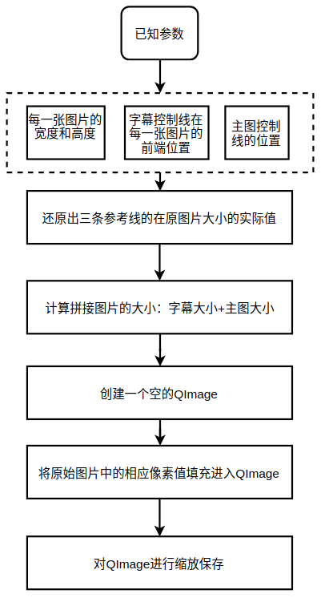

</div>

下面是getshotinfo类的实现。

```c++
//Zimu/getshotinfo.cpp
#include <getshotinfo.h>
#include<QImage>
#include<QRgb>
#include<QColor>
#include <QDebug>
#include <QImage>
Shotinfo::Shotinfo(QObject *parent) :
    QObject(parent)
{
    // 初始化创建一个新 ImageProvider类
    m_pImgProvider = new ImageProvider();
}
Shotinfo::~Shotinfo()
{
    // 删除ImageProvider类
    delete m_pImgProvider;
}
QString Shotinfo::imgurl()
{
    // 只读，返回myimgurl
    return myimgurl;
}
int Shotinfo::sourcewidth()
{
    // 只读，返回mysourcewidth
    return mysourcewidth;
}
void Shotinfo::saveImage(QString saveurl,int scaled)
{
    // 保存图片
    // 设置保存路径
    QString ressaveurl = saveurl.mid(7)+"/字幕拼图.png";
    QImage scaledimg;
    if(scaled < (m_pImgProvider->img.width())/4)
    {
        scaled = (m_pImgProvider->img.width())/4;
    }
    double scaledwidthbili = scaled*1.0 / (m_pImgProvider->img.width()*1.0);
    // 对图片进行缩放
    scaledimg = m_pImgProvider->img.scaled(scaled,m_pImgProvider->img.height()*scaledwidthbili);
    scaledimg.save(ressaveurl);
}
void Shotinfo::setImage(int scaledwidth,double pos1,double pos2,double mainposition)
{
    if(myimgurls.length()>0)
    {
        QImage tempimg;
        // 读入第一张图片
        QString tempurl =myimgurls[0].mid(7);
        tempimg.load (tempurl);
        // 图片的宽度
        mysourcewidth = tempimg.width();
        int totalheight;
        // 图片长宽比
        double scaledbili = (mysourcewidth*1.0) / (scaledwidth*1.0);
        // 还原出原图片的字幕上面一条线位置
        int pos1scaled = pos1*scaledbili;
        // 还原图片字幕的第二条直线位置
        int pos2scaled = pos2*scaledbili;
        // 还原主图区域直线的位置
        int mainpositionscaled = mainposition*scaledbili;
        // 每一个图片字幕的高度
        int zimuheight = pos2scaled - pos1scaled;
        // 图片的数目
        int zimucount = myimgurls.length()-1;
        // 拼接图片的总高度
        totalheight = pos2scaled - mainpositionscaled + zimucount *zimuheight;
        // 依据计算的拼接图片的宽度和高度，新建一个QImage
        QImage lastimg(mysourcewidth,totalheight,QImage::Format_RGB32);
        for(int i=0;i<myimgurls.length();i++)
        {
            QImage img;
            // 初始的y值
            int initialy;
            if(i==mymainindex)
            {
                // 如果图片是主图，initialy为主图位置
                initialy = mainpositionscaled;
            }
            else
            {
                // 否则是第一条字幕线位置
                initialy = pos1scaled;
            }
            // 加载图片
            img.load(myimgurls[i].mid(7));
            for(int x = 0;ximg = lastimg;
        // 完成拼接，触发更新前端
        emit callQmlRefeshImg();
    }
}
void Shotinfo::setImgurl(QString &imgurl)
{
    // 设置imgurl
    if (myimgurl != imgurl)
            {
               myimgurl = imgurl;
               emit setHeight();
            }
}
QVector<QString> Shotinfo::imgurls()
{
    // 返回myimgurls
    return myimgurls;
}
void Shotinfo::setImgurls(QVector<QString> &imgurls)
{
    // 设置imgurls
    if(myimgurls != imgurls)
    {
        myimgurls = imgurls;
    }
}

int Shotinfo::mainindex()
{
    return mymainindex;
}
void Shotinfo::setMainindex(int &mainindex)
{
     // 设置主图index
     mymainindex = mainindex;
}
double Shotinfo::imgscaleheight()
{
   return myimgscaleheight;
}
void Shotinfo::setHeight()
{
    // 设置图片的长宽比，传递给前端显示。
    QImage tempimg;
    QString y = myimgurl.mid(7);
    tempimg.load(y);
    double w = tempimg.width();
    double h = tempimg.height();
    myimgscaleheight = w/h;
}
```
### 2.3 main.cpp

虽然我们实现了两个cpp文件，但是并没有和qml产生联系。这里我们需要重新修改一下main.cpp文件。
这里主要实现了两个功能：将我们需要与qml交互的类注册到qml中，并起了一个别名，在qml中可以直接用这个别名实现与qml中自带的类同样的语法形式，里面的属性就是在类中实现的各种函数。第二,addImageProvider 提供了刷新图片的接口。
```c++
// Zimu/main.cpp
#include <QGuiApplication>
#include <QQmlApplicationEngine>
#include <QQmlContext>
// 导入实现的类
#include <getshotinfo.h>
int main(int argc, char *argv[])
{
    QCoreApplication::setAttribute(Qt::AA_EnableHighDpiScaling);

    QGuiApplication app(argc, argv);
    QQmlApplicationEngine engine;
    Shotinfo *showmyinfo = new Shotinfo();
    // 设置getshotinfo在qml中的别名为showmyinfo
    engine.rootContext()->setContextProperty("myshotinfo",showmyinfo);
    // 设置与qml实现图片刷新的接口路径，diffurls。接口的类showmyinfo->m_pImgProvider
    engine.addImageProvider(QLatin1String("diffurls"),showmyinfo->m_pImgProvider);
    // 设置主qml的路径
    engine.load(QUrl(QStringLiteral("qrc:/main/Main.qml")));
    if (engine.rootObjects().isEmpty())
        return -1;
    return app.exec();
}
```
## 三，Main.qml的实现

Main.qml是qml文件与main.cpp交互的文件，所有的qml文件最终直接或间接被它调用，否则就无法产生效果。主文件中设置的变量可以被其他文件直接引入，这里我们就定义了很多变量，比如视图列表模型，在对字幕图片进行调整时就被修改。

```css
import QtQuick 2.9
import QtQuick.Controls 2.3
import QtQuick.Window 2.2
import "../left" as Left
Window {
    id :mainRoot
    visible: true
    modality: Qt.ApplicationModal;
    // 用来移动窗口的数据
    property real mouseXTMP: 0
    property real mouseYTMP: 0
    // 设置窗口宽度
    width: Screen.desktopAvailableWidth*0.6
    // 设置窗口高度
    height: Screen.desktopAvailableHeight*0.6
    // 一大波全局变量来袭
    // 全局变量 图片的数量
    property int urlcounts: 0
    // 主程序宽度
    property double mainwindowwidth: width
    // 主程序窗口的高度
    property double mainwindowheight: height
    // 图片是否上传完毕
    property bool picdownloaded: false
    // 转换按钮的透明度
    property double transformbtnopacity: 0.4
    // 控制线1,2,3
    property double position1: 0
    property double position2: 0
    property double mainposition: 0
    property int sourcewidth: mainwindowwidth/2 - 30
    //用于记录主视图的index
    property int mainshotindex: 0
    // 无框架的窗口
    flags:Qt.FramelessWindowHint | Qt.WindowStaysOnTopHint
    // 全局变量，左侧视图列表模型。这个变量很重要，
    // 它被很多qml文件调用和修改其值
    Left.Imagelistmodel
    {
        id:imagemodellist
    }
    // 来实现窗口移动
    MouseArea {
               anchors.fill: parent
               onPressed: {
                   mouseXTMP = mouseX
                   mouseYTMP = mouseY
               }
               onPositionChanged: {
                   mainRoot.x = mouseX + mainRoot.x - mouseXTMP
                   mainRoot.y = mouseY + mainRoot.y - mouseYTMP
               }

           }
    // 窗口背景色
    Rectangle
    {
        width: Screen.desktopAvailableWidth*0.6
        height: Screen.desktopAvailableHeight*0.6
        opacity: 0.5
        color: "gray"
    }
    // 按列布局
    Column
    {
        Top // 顶部标题栏
        {
            width: mainwindowwidth
            height: 20
        }
        // 中部图片相关
        Mid
        {
            width: mainwindowwidth
            height: mainwindowheight-60
        }
        // 底部按钮操作
        Bottom
        {
            width: mainwindowwidth
            height: 10
        }
    }
}
```
## 四，实验小结

本次实验介绍了C++相关的代码，并且最后实现了Main.qml。由于本次实验的代码量还是比较大，有一些非关键文件没有进行介绍，但是我希望学习的同学可以按照顺序自己创建文件，自己敲代码，也可以自己尝试修改，遇到问题时再参见源码。最后希望通过本次实验，都能有所收获！

